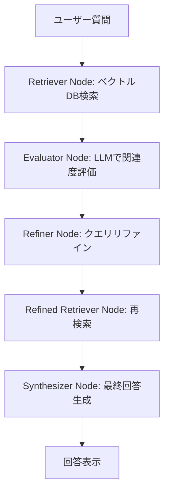

# AgenticRag

## 概要

AgenticRagは、LangGraphの最新APIと共通モジュール（components/pdf_processor, model_loader/load_llm）を活用したエージェント型RAG（Retrieval Augmented Generation）システムです。PDFから知識ベースを自動構築し、ユーザーの質問に対して段階的な検索・評価・クエリリファイン・最終回答生成を行います。

---
## 参考文献と本プログラムの狙い
[AGENTIC RETRIEVAL-AUGMENTED GENERATION: A SURVEY ON
AGENTIC RAG](https://arxiv.org/abs/2501.09136)

Aditi Singh, Abul Ehtesham, Saket Kumar, Tala Talaei Khoei

本プログラムは上記論文のアイデア・アルゴリズムを参考に実装されています。しかしながら、理論の評価や利用を目的としたものではなく、実装練習として一部の機能を実装しています。

---

## 特徴
- 設定ファイル駆動：`AgenticRag/config.ini` でLLMやベクトルDB、PDFパス等を一元管理
- 共通モジュール利用：PDF処理・ベクトルDB構築・LLMロードを再利用可能なモジュールで実装
- Streamlit UI：Webブラウザから簡単に質問・回答が可能

---

## フロー




1. **Retriever Node**
    - ユーザーの質問を受け取り、ベクトルDBから関連文書を検索
2. **Evaluator Node**
    - 検索結果の各文書について、LLMで関連度を1～5で評価し根拠を生成
3. **Refiner Node**
    - 質問と評価結果をもとに、より良い検索のためのリファインドクエリをLLMで生成
4. **Refined Retriever Node**
    - リファインドクエリで再度ベクトルDB検索
5. **Synthesizer Node**
    - リファインドクエリと再検索結果をもとに、LLMで最終回答を生成

各ノードはLangGraphのStateGraphで直列につながり、状態（state）はTypedDictで管理されます。

---

## セットアップ

1. `AgenticRag/config.ini` を編集し、使用するLLMやPDFファイル、ベクトルDB保存先などを設定
    ```ini
    [LLM]
    PROVIDER = ollama

    [ollama]
    BASE_URL = http://localhost:11434
    MODEL = gemma3:4b-it-qat

    [embedding]
    MODEL = intfloat/multilingual-e5-small

    [vectorstore]
    DIRECTORY = ./vectorstore

    ```
3. PDFファイルを指定のパスに配置

---

## 実行方法

```bash
streamlit run agenticrag.py
```

---

## 使い方

1. ブラウザで表示されるUIに質問を入力
2. 「実行」ボタンを押すと、以下の流れで回答が生成されます
    - Retrieval Agent Output: 質問に関連する文書をベクトルDBから検索
    - Evaluator Output: 検索結果の関連度をLLMで評価
    - Refined Query: 評価結果をもとにクエリをリファイン
    - Secondary Retrieval: リファイン後のクエリで再検索
    - Final Answer: 最終回答を生成

---

## ディレクトリ構成

```
AgenticRag/
├── agenticrag.py
├── config.ini
├── README.md
components/
    └── pdf_processor.py
model_loader/
    └── load_llm.py
vectorstore/
    └── ...
```

---

## 注意事項
- LLMプロバイダやモデルによっては、別途APIキーやローカルサーバーの起動が必要です。
- ベクトルDBやPDFのパスはconfig.iniで必ず正しく指定してください。

---

