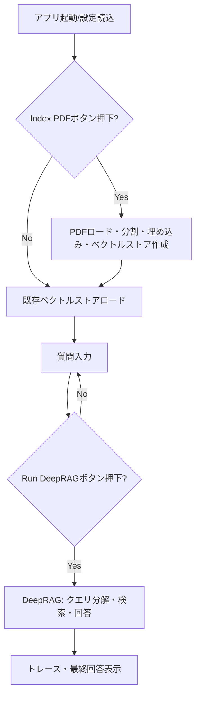
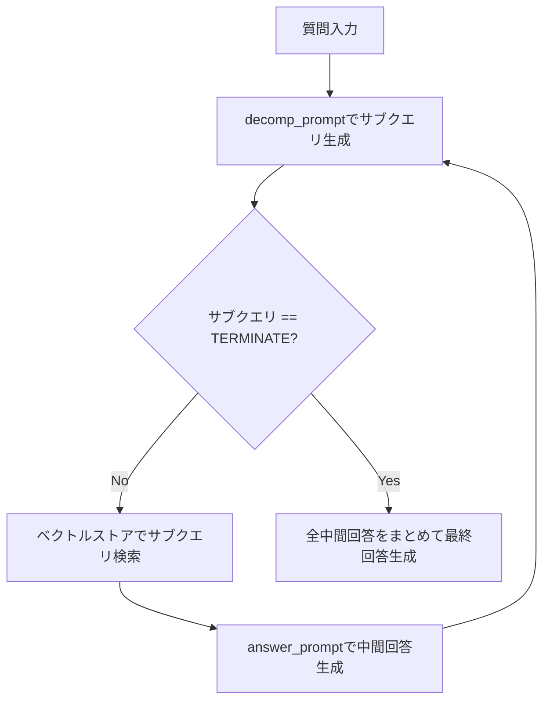

# DeepRAG: Step-by-Step RAG Demo

このアプリケーションは、PDF文書を知識ベースとして活用し、段階的なクエリ分解と検索を行うRAG（Retrieval-Augmented Generation）システムのデモです。Streamlitで動作し、OllamaローカルLLMやHuggingFace埋め込みを活用しています。

## 参考論文
[DeepRAG: Thinking to Retrieval Step by Step for Large Language Models](https://arxiv.org/abs/2502.01142)

Xinyan Guan, Jiali Zeng, Fandong Meng, Chunlei Xin, Yaojie Lu, Hongyu Lin, Xianpei Han, Le Sun, Jie Zhou

本プログラムは上記論文のアイデア・アルゴリズムを参考に実装されています。しかしながら、理論の評価や利用を目的としたものではなく、参考目的として実装しています。

## 特徴
- **PDFから知識ベース構築**: 指定PDFを分割・埋め込みし、Chromaベクトルストアに保存。
- **Ollama LLM対応**: Ollama経由でローカルLLM（例: gemma3:4b-it-qat）を利用。
- **HuggingFace埋め込み**: HuggingFaceの埋め込みモデルを利用。
- **段階的クエリ分解（DeepRAG）**: 質問をサブクエリに分解し、各サブクエリごとに検索・回答を繰り返し、最終回答を生成。
- **Streamlit UI**: 質問入力、インデックス作成、分解・検索・回答のトレース表示、DEBUGモードで検索コンテキストも確認可能。

---

## 全体フロー（フローチャート）



---

## コード主要部の詳細解説

### 1. 設定・初期化
- `config.ini` からPDFパス、モデル名、ベクトルストアディレクトリ等を読み込みます。
- HuggingFace埋め込み、Chromaベクトルストア、Ollama LLMを初期化します。

### 2. インデックス作成
- 「Index PDF」ボタン押下時、PDFをロードし、テキスト分割・埋め込みを行い、Chromaベクトルストアに保存します。
- 2回目以降は既存のベクトルストアをロードします。

### 3. DeepRAGクラスの仕組み
- **binary_tree_search** メソッドで、
    1. 質問をLLMで「次のサブクエリ」へ分解（`decomp_prompt`）
    2. サブクエリが「TERMINATE」になるまで再帰的に分解・検索・回答
    3. 各サブクエリごとにベクトルストアで検索し、文脈を抽出
    4. 文脈を使ってLLMで中間回答（`answer_prompt`）
    5. 全サブクエリの中間回答をまとめて最終回答を生成

#### サブクエリ分解・検索・回答の流れ


### 4. Streamlit UI
- 質問入力欄、インデックス作成ボタン、Run DeepRAGボタンを提供。
- トレース表示で各サブクエリ・検索・中間回答を確認可能。
- DEBUGモードONで、各サブクエリごとに実際に検索された文書内容（コンテキスト）も表示。

### 5. コードのポイント
- `PromptTemplate` でプロンプトを柔軟に設計。
- LLM呼び出しは `OllamaLLM.invoke()` を利用。
- ベクトルストアはChroma、埋め込みはHuggingFace。
- 設定値はすべて `config.ini` で一元管理。

---

## 依存パッケージ
- streamlit
- langchain-ollama
- langchain-chroma
- langchain-huggingface
- langchain_community
- chromadb
- torch, configparser など

## 設定例（config.ini）
```
[ollama]
BASE_URL = http://localhost:11434

[embedding]
MODEL = intfloat/multilingual-e5-small

[llm]
MODEL = gemma3:4b-it-qat

[vectorstore]
DIRECTORY = ./vectorstore

[pdf]
PATH = DeepRag/2502.01142v1.pdf
```

## 注意事項
- PDFのパスやベクトルストアのディレクトリは環境に合わせて変更してください。
- 初回は「Index PDF」でインデックスを作成してください。
- LLMや埋め込みモデルのダウンロードには時間がかかる場合があります。
