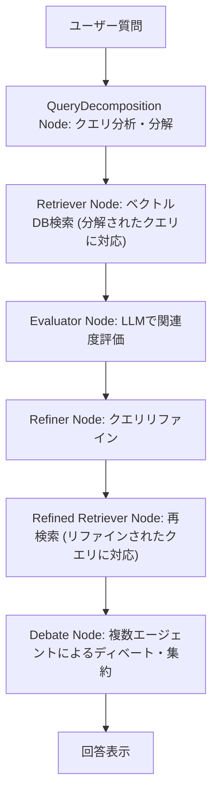

# DeepStepRAG: Combined RAG Demo

This repository implements a new RAG system, DeepStepRAG, combining elements from existing RAG implementations in this repository, specifically AgenticRag, DeepRag, and MADAM-RAG (MRD_Rag).

## Overview

DeepStepRAG is an agentic RAG system built using LangGraph. It dynamically decides whether to decompose complex queries (inspired by DeepRag) before initial retrieval and incorporates a multi-agent debate and aggregation step (inspired by MADAM-RAG) before generating the final answer.

## Features

- **Dynamic Query Decomposition**: Analyzes the complexity of the user query and dynamically decides whether to break it down into sub-queries for more targeted retrieval.
- **Agentic Workflow**: Utilizes LangGraph for a structured, multi-step process including retrieval, evaluation, refinement, and debate.
- **Multi-Agent Debate & Aggregation**: Before final answer generation, multiple agents with different roles and temperature settings debate based on retrieved documents, and an aggregator synthesizes their perspectives into a final answer.
- **Configurable**: Settings for LLMs, embedding models, vector stores, PDF paths, query decomposition logic, and debate parameters are managed via `config.ini`.
- **Streamlit UI**: Provides a web interface for interacting with the RAG system.

## Workflow



1.  **QueryDecomposition Node**: Analyzes the input query and decides whether to decompose it.
2.  **Retriever Node**: Performs initial retrieval based on the original or decomposed query.
3.  **Evaluator Node**: Evaluates the relevance of retrieved documents.
4.  **Refiner Node**: Refines the query based on evaluation.
5.  **Refined Retriever Node**: Performs a second retrieval with the refined query.
6.  **Debate Node**: Multiple agents debate based on the final set of retrieved documents, and an aggregator produces a synthesized answer.
7.  **Answer Display**: Presents the final answer to the user.

## Setup

1.  Edit `DeepStepRAG/config.ini` to configure your LLM, embedding model, vector store directory, and PDF path.
2.  Place your PDF file at the path specified in `config.ini`.
3.  Ensure you have the necessary dependencies installed (see `Pipfile` in the root directory). You may need to install additional libraries specific to LangGraph, Ollama, Chroma, and HuggingFace if not already present.

## Execution

```bash
streamlit run DeepStepRAG/deepsteprag.py
```

## Usage

1.  Open the Streamlit application in your web browser.
2.  Use the UI to index your PDF document (if not already indexed).
3.  Enter your query and run the RAG process.
4.  Observe the steps (retrieval, evaluation, refinement, debate) and the final generated answer.

## Directory Structure

```
DeepStepRAG/
├── deepsteprag.py
├── config.ini
├── README.md
```
- This implementation utilizes common components from the root `components/` and `model_loader/` directories.

## Notes

- Ensure your Ollama server is running if using an Ollama model.
- Adjust model names and paths in `config.ini` as needed.
- The dynamic decomposition and debate logic will be implemented in `deepsteprag.py`.
