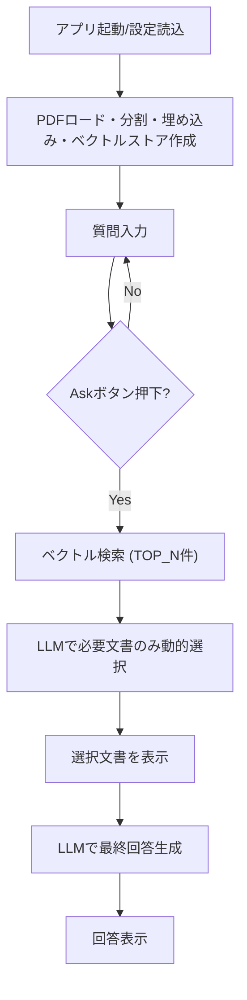

# DynamicRAG: Dynamic Document Selection RAG Demo

このアプリケーションは、PDF文書を知識ベースとして活用し、動的なドキュメント選択・再ランキングを行うRAG（Retrieval-Augmented Generation）システムのデモです。Streamlitで動作し、OllamaローカルLLMやHuggingFace埋め込みを活用しています。

# 参考
[DynamicRAG: Leveraging Outputs of Large Language Model as Feedback for Dynamic Reranking in Retrieval-Augmented Generation](https://arxiv.org/abs/2505.07233)

Jiashuo Sun, Xianrui Zhong, Sizhe Zhou, Jiawei Han

本プログラムは上記論文のアイデア・アルゴリズムを参考に実装されています。しかしながら、理論の評価や利用を目的としたものではなく、参考目的として実装しています。

---

## 特徴
- **PDFから知識ベース構築**: 指定PDFを分割・埋め込みし、Chromaベクトルストアに保存。
- **Ollama LLM対応**: Ollama経由でローカルLLM（例: gemma3:4b-it-qat）を利用。
- **HuggingFace埋め込み**: HuggingFaceの埋め込みモデルを利用。
- **動的再ランキング**: LLMを用いて、検索候補文書から本当に必要な文書のみを動的に選択。
- **Streamlit UI**: 質問入力、インデックス作成、選択文書・回答の表示。

---

## 使い方
1. `config.ini` でPDFパスやモデル名、ベクトルストアディレクトリなどを設定します。
2. Streamlitでアプリを起動します。
   ```bash
   streamlit run DynaRag.py
   ```
3. 初回は自動でインデックスが作成されます。
4. 質問を入力し「Ask」ボタンを押すと、
   - ベクトル検索で候補文書（TOP_N件）を取得
   - LLMで本当に必要な文書のみを動的に選択
   - その文脈でLLMが回答を生成

---

## 全体フロー（フローチャート）



---

## コード主要部の説明

- `load_vectorstore`: PDFをロードし、分割・埋め込み・Chromaベクトルストア化。
- `RERANKER_PROMPT`: LLMに候補文書リストと質問を与え、「本当に必要な文書の番号だけ」を抽出させるプロンプト。
- `GENERATOR_PROMPT`: 選択された文書（またはNone）を文脈としてLLMに回答生成させるプロンプト。
- Streamlit UIで質問入力・文書選択・回答生成の流れを可視化。

---

## 依存パッケージ
- streamlit
- langchain-ollama
- langchain-chroma
- langchain-huggingface
- langchain_community
- chromadb
- torch, configparser など

---

## 設定例（config.ini）
```
[ollama]
BASE_URL = http://localhost:11434
MODEL = gemma3:4b-it-qat

[embedding]
MODEL = intfloat/multilingual-e5-small

[vectorstore]
DIRECTORY = ./vectorstore_dynamicrag

[pdf]
PATH = 2502.01142v1.pdf
```

---

## 注意事項
- PDFのパスやベクトルストアのディレクトリは環境に合わせて変更してください。
- LLMや埋め込みモデルのダウンロードには時間がかかる場合があります。

---

本アプリは動的な文書選択・再ランキングの挙動を体験したい方向けのデモです。
