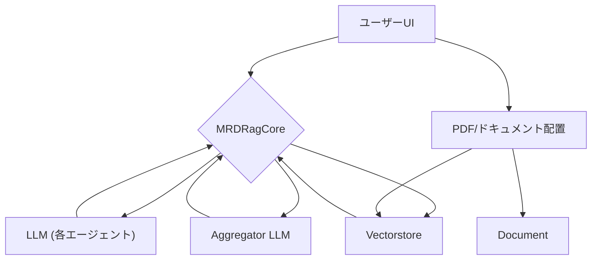

# MADAM-RAG (Multi-Round Debate & Aggregation Multi-agent RAG)

本ディレクトリは、複数エージェントによるディベートと集約を特徴としたRAG（Retrieval Augmented Generation）システム「MADAM-RAG」のStreamlitデモ実装です。  
各エージェントは異なる役割・温度で文書から根拠を抽出し、最終的な回答はアグリゲータが集約・説明します。

---

## 参考文献と本プログラムの狙い
[Retrieval-Augmented Generation with Conflicting Evidence](https://arxiv.org/abs/2504.13079)

Han Wang, Archiki Prasad, Elias Stengel-Eskin, Mohit Bansal

本プログラムは上記論文のアイデア・アルゴリズムを参考に実装されています。しかしながら、理論の評価や利用を目的としたものではなく、実装練習として一部の機能を実装しています。

## 特徴

- **マルチエージェント・ディベート**:  
  4つの異なる役割（例: 批判的・要約・簡潔・クロスチェック）を持つエージェントが独立して回答を生成
- **多様性のための温度設定**:  
  各エージェントは異なるtemperatureでLLMを呼び出し、多様な視点を確保
- **アグリゲータによる集約**:  
  各エージェントの出力をもとに、最終回答とその根拠説明をJSON形式で生成
- **PDF全文検索・RAG**:  
  PDFから分割・埋め込み・検索を行い、関連文書を根拠として利用
- **Streamlit UI**:  
  インデックス作成・質問入力・各ラウンドの出力・最終回答をWebで可視化

---

## ディレクトリ構成

```
MRD_Rag/
├── mrdrag.py         # メインStreamlitアプリ・RAGコア
├── README.md         # このファイル
├── 2504.13079v1.pdf  # デモ用PDF（例）
```
- 共通部品（`model_loader/`, `components/`）や設定ファイル（`config.ini`）はプロジェクトルートまたはDeepRag配下を参照

---

## 必要環境

- Python 3.9+
- [Ollama](https://ollama.com/) サーバー（ローカルまたは指定URL）

---

## セットアップ

1. 設定ファイルの編集  
   `DeepRag/config.ini` を編集し、以下を指定
    - `[llm]` モデル名（例: llama2, gemma3 など）
    - `[embedding]` 埋め込みモデル名
    - `[vectorstore]` 保存ディレクトリ
    - `[document]` PDFファイルパス
    - `[mrdrag]` NUM_AGENTS, MAX_ROUNDS など

2. PDFファイルを `PDF_PATH` で指定した場所に配置

---

## 実行方法

```sh
streamlit run mrdrag.py
```

- 「Index PDF」ボタンでPDF全文をインデックス化
- 質問を入力し「Run MADAM-RAG」ボタンで多段ディベート＆集約を実行
- 各ラウンドのエージェント出力・アグリゲータの集約・最終回答が表示されます

---

## コアロジック概要

- **MRDRagCore** クラスで、各エージェントに異なる役割・温度を割り当ててLLMを呼び出し
- 各エージェントの出力を集約プロンプトに渡し、アグリゲータが最終回答と説明をJSONで返す
- 複数ラウンド繰り返し、最終的な合意形成を目指す

---

## カスタマイズ例

- エージェント数や役割、温度は `config.ini` または `AGENT_ROLES`/`AGENT_TEMPS` で調整可能
- プロンプトや集約ロジックを変更することで、独自のRAG戦略を実験可能

---

## 参考

- [../guidelines.md](../guidelines.md): RAGシステム共通仕様
- [../DeepRag/deeprag.py](../DeepRag/deeprag.py): ステップバイステップ型RAGの実装例

---

## RAGシステム設計フローチャート



- **ユーザーUI**: Streamlitで質問入力・結果表示
- **MRDRagCore**: クエリ分解・エージェント生成・集約のコアロジック
- **LLM (各エージェント)**: 役割・温度ごとに分岐し、文書根拠に基づく回答生成
- **Vectorstore**: PDFから分割・埋め込み・検索
- **Aggregator LLM**: 各エージェントの出力を集約し、最終回答・説明を生成
- **PDF/ドキュメント**: 入力データ

---

