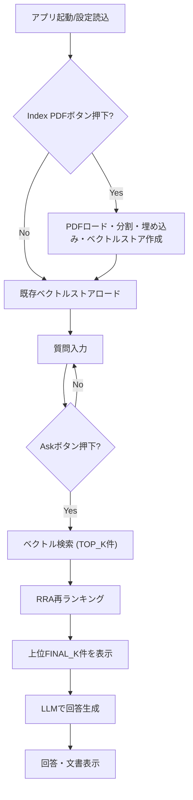

# RRARag: Rational Retrieval Acts (RRA) RAG Demo

このアプリケーションは、Rational Retrieval Acts (RRA) に基づく再ランキングを用いたRAG（Retrieval-Augmented Generation）デモです。Streamlitで動作し、PDFから知識ベースを構築し、ユーザーの質問に対して関連文書を再ランキングして回答を生成します。

## 参考論文
[Rational Retrieval Acts: Leveraging Pragmatic Reasoning to Improve Sparse Retrieval](https://arxiv.org/abs/2505.03676)
Arthur Satouf, Gabriel Ben Zenou, Benjamin Piwowarski, Habiboulaye Amadou Boubacar, Pablo Piantanida

本プログラムは上記論文のアイデア・アルゴリズムを参考に実装されています。しかしながら、理論の評価や利用を目的としたものではなく、参考目的として実装しています。

## 特徴
- **PDFからの知識ベース構築**: 指定したPDFを分割・埋め込みし、Chromaベクトルストアに保存します。
- **Ollama LLM対応**: Ollama経由でローカルLLM（例: gemma3:4b-it-qat）を利用可能。
- **HuggingFace埋め込み**: HuggingFaceの埋め込みモデルを利用。
- **RRA再ランキング**: ベクトル検索で取得した候補文書をRRAアルゴリズムで再ランキング。
- **Streamlit UI**: 質問入力、インデックス作成、再ランキング結果・回答の表示。

## 使い方
1. `config.ini` でPDFパスやモデル名、ベクトルストアディレクトリなどを設定します。
2. Streamlitでアプリを起動します。
   ```bash
   streamlit run rrarag.py
   ```
3. 「Index PDF」ボタンでPDFをインデックス化します（初回のみ）。
4. 質問を入力し「Ask」ボタンを押すと、
   - ベクトル検索で候補文書（TOP_K件）を取得
   - RRAアルゴリズムで再ランキングし、上位（FINAL_K件）を表示
   - その文脈でLLMが回答を生成

## RRAアルゴリズム概要
- クエリと文書をトークン化し、各文書の単語分布を計算
- RSA（Rational Speech Acts）に基づき、文書とクエリの関連度を再計算
- 関連度スコアで文書を再ランキング

---

## コード詳細・フロー解説

### 全体フロー



### コード主要部の説明

#### 1. 設定・初期化
- `config.ini` から各種パラメータ（PDFパス、モデル名、ベクトルストアディレクトリ等）を読み込みます。
- HuggingFace埋め込み、Chromaベクトルストア、Ollama LLMを初期化します。

#### 2. インデックス作成
- `Index PDF` ボタン押下時、PDFをロードし、テキスト分割・埋め込みを行い、Chromaベクトルストアに保存します。
- 2回目以降は既存のベクトルストアをロードします。

#### 3. 質問処理・RRA再ランキング
- 質問入力後、「Ask」ボタン押下で以下の流れ：
    1. ベクトルストアから質問に近いTOP_K件の文書を取得
    2. 各文書の単語分布を計算（`build_term_doc_weights`）
    3. RRAアルゴリズム（`compute_RRA_scores`）で再ランキング
    4. 上位FINAL_K件を文脈としてLLMに渡し、回答を生成

#### 4. RRAアルゴリズムの詳細
- クエリ・文書をトークン化し、単語ごとの重みを計算
- RSA（Rational Speech Acts）理論に基づき、
    - L0: 各単語ごとに文書分布を計算
    - S1: 各文書ごとに単語分布を計算
    - L1: 各単語ごとに文書分布を再計算
- クエリの単語重みとL1スコアの積和で最終スコアを算出し、文書を再ランキング

#### 5. 回答生成
- 上位文書をまとめて文脈とし、PromptTemplateでLLMに渡して回答を生成します。

---

## 依存パッケージ
- streamlit
- langchain-ollama
- langchain-chroma
- langchain-huggingface
- langchain_community
- chromadb
- その他: torch, configparser, collections, math

## 設定例（config.ini）
```
[ollama]
BASE_URL = http://localhost:11434

[embedding]
MODEL = intfloat/multilingual-e5-small

[llm]
MODEL = gemma3:4b-it-qat

[vectorstore]
DIRECTORY = ./vectorstore

[pdf]
PATH = 2505.03676v1.pdf
```

## 注意事項
- PDFのパスやベクトルストアのディレクトリは環境に合わせて変更してください。
- 初回は「Index PDF」でインデックスを作成してください。
- LLMや埋め込みモデルのダウンロードには時間がかかる場合があります。

---

本アプリはRRAによる再ランキングの挙動を体験したい方向けのデモです。
