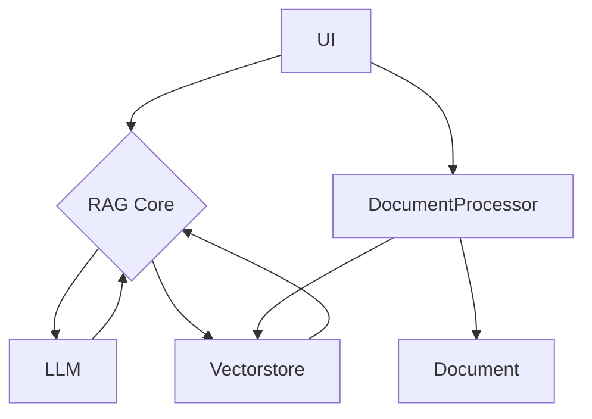

# RAGシステム共通仕様書

## 概要

本ドキュメントは、Retrieval Augmented Generation (RAG) システムの一般的な構造と主要コンポーネントの仕様を示します。これにより、様々なRAG手法の実装・比較・拡張が容易になります。

## アーキテクチャ

RAGシステムは、以下の主要コンポーネントで構成されます。



* **UI:** ユーザーインターフェース。質問入力や結果表示を担当。
* **RAG Core:** クエリ分解、検索、回答生成などRAGのコアロジックを管理。
* **LLM:** 言語モデルのロード・推論を担当。
* **Vectorstore:** ドキュメントの埋め込み保存・検索を担当。
* **DocumentProcessor:** ドキュメントの読み込み・前処理・インデックス作成を担当。
* **Document:** 処理対象となる元データ。

## 主要コンポーネント仕様

### RAG Coreクラス（例: `RAGCore`）

- **目的:** ユーザーの質問に対して、段階的なクエリ分解と検索を行い、最終的な回答を生成する。
- **必須メソッド例:**
    - `__init__(self, llm, vectorstore)`
    - `decompose_prompt`: クエリ分解用プロンプト
    - `answer_prompt`: 回答生成用プロンプト
    - `search(self, question: str, max_depth: int = 5) -> Tuple[str, List[dict]]`
        - 再帰的にサブクエリ生成・検索・中間回答生成を行い、最終回答とトレース情報を返す

#### プロンプト例

```text
You are a RAG system that decomposes queries step-by-step.
History: {history}
Main Question: {question}
Generate the next atomic subquery or 'TERMINATE' to finish.
```

```text
Use the following context to answer the query.
Context: {context}
Query: {query}
Answer concisely.
```

#### アルゴリズム例

1. 現在の質問と履歴に基づき、`decompose_prompt` で次のサブクエリを生成
2. サブクエリが 'TERMINATE' でなければ、Vectorstoreで類似検索し関連ドキュメントを取得
3. 取得ドキュメントをコンテキストに `answer_prompt` で中間回答を生成
4. ステップを記録し、再帰的に次のサブクエリへ
5. 'TERMINATE' または最大深度で再帰終了
6. 全中間回答を結合し、最終コンテキストとしてLLMで最終回答を生成
7. 最終回答とトレース情報を返す

### DocumentProcessorクラス

- **目的:** ドキュメントの読み込み、テキスト分割、埋め込み生成、Vectorstoreへの保存/ロード
- **主要メソッド例:**
    - `index_documents()`
    - `load_vectorstore()`

### LLMローダ

- **目的:** 設定に基づき、指定プロバイダー・モデルのLLMインスタンスをロード

### Vectorstore

- **目的:** ドキュメント埋め込みの保存・検索

## 設定ファイル例 (`config.ini`)

- `[llm]` モデル名
- `[embedding]` 埋め込みモデル名
- `[vectorstore]` 保存ディレクトリ
- `[document]` 入力ファイルパス

## 実行方法（例）

1. 依存関係インストール
2. 設定ファイル編集
3. ドキュメント配置
4. アプリケーション実行
5. UIでインデックス作成・質問入力・回答取得

## 拡張性

- 各コンポーネントは独立して差し替え可能
- RAG Coreのメソッドを追加・置換することで多様なRAG戦略を実装可能
- DocumentProcessorの再利用で異なるRAGでも共通パイプライン利用可

---

## 参考実装（DeepRAG等）

DeepRAGや他の具体的な実装例は付録や別セクションで紹介し、本文は抽象仕様に徹するのが理想です。

### 共有モジュール・ユーティリティ

- **目的:** 複数のRAG実装間で共通利用できる関数やクラス、設定管理、前処理、モデルローダなどをまとめ、再利用性・保守性を高める。
- **例:**
    - `model_loader/` ディレクトリ: LLMローダや共通のモデル管理関数
    - `components/pdf_processor.py`: PDFや他ドキュメントの読み込み・分割・埋め込み生成・Vectorstore管理
    - 共通の設定ファイル（`config.ini` など）
    - 汎用的なプロンプトテンプレートや検索ユーティリティ

#### 利用例

- 各RAG実装（例: DeepRAG, DynamicRag, RRARagなど）は、`model_loader`や`components`配下の共通モジュールをimportして利用することで、重複実装を避け、開発効率・品質を向上できる。
- 新たなRAG戦略を追加する場合も、コアロジックのみを実装すればよく、前処理やモデルロード部分は共通モジュールを流用可能。
